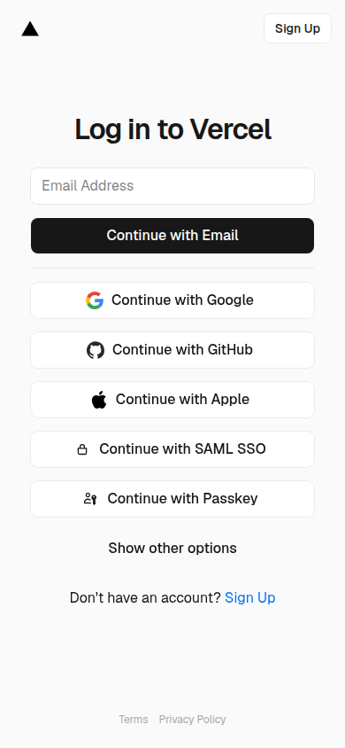
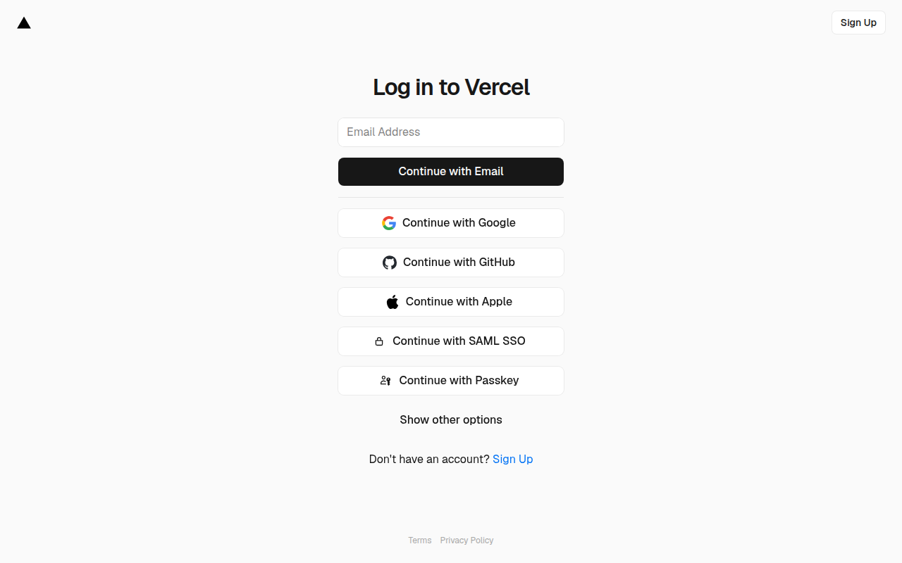

# StellarForge

**Advanced NFT Minter, Asset Factory & Digital Rights Platform**

*Built on Stellar | Powered by Soroban | Level 3 (Orange Belt) Submission*

[](https://soroban.stellar.org)
[](https://rust-lang.org)
[](https://nextjs.org)
[](LICENSE)
[](https://github.com/olaleyeolajide81-sketch/StellarForge/actions/workflows/ci.yml)
[](https://stellarforge-demo.vercel.app)
[](https://github.com/olaleyeolajide81-sketch/StellarForge/raw/main/stellarforge-demo.mp4)

---

> ✅ **All tests passing**: Contract tests (12/12) and frontend tests (10/10) pass. The contracts have been upgraded to `soroban-sdk 27.0.2`. See [Test Coverage](#test-coverage) for details.

---

## Architecture Overview

StellarForge is a full-stack decentralized application (dApp) for minting, managing, and trading NFTs on the Stellar network using Soroban smart contracts. It features a dual-contract architecture with inter-contract communication, real-time event streaming, IPFS-backed metadata storage, and a mobile-responsive frontend.

### System Architecture Diagram

```
+-------------------------------------------------------------+
|                        USER BROWSER                          |
|  +------------------+  +------------------+  +------------+  |
|  |   Mint Wizard     |  |   NFT Gallery    |  | Activity  |  |
|  | (Drag & Drop)    |  | (IPFS Rendering) |  | Feed      |  |
|  +--------+---------+  +--------+---------+  +-----+------+  |
|           |                     |                    |        |
|  +--------v---------------------v--------------------v------+|
|  |              Next.js App Router (TypeScript)              ||
|  |  +---------------------------------------------------+   ||
|  |  | @stellar/freighter-api | @stellar/stellar-sdk     |   ||
|  |  | Pinata IPFS Client     | SorobanRpc Event Polling |   ||
|  |  +---------------------------------------------------+   ||
|  +----------------------------------------------------------+|
+-----------------------------+-------------------------------+
                              |
              +---------------v----------------+
              |     STELLAR TESTNET RPC         |
              |  soroban-testnet.stellar.org    |
              +----------------+----------------+
                               |
        +----------------------+----------------------+
        |                                              |
+-------v-------+                            +---------v-------+
|  ForgeFactory  |                            |    ForgeNFT     |
|   (Factory)    |---- deploy_nft() --------->|   (NFT Token)   |
|                |---- mint_via_factory() ---->|                 |
|  - Registry    |                            |  - mint()       |
|  - Fee Mgmt    |                            |  - transfer()   |
|  - Deployer    |                            |  - metadata     |
+----------------+                            +-----------------+
        |                                              |
        +--------------- IPFS PINATA ------------------+
                        (Metadata & Assets)
```

### Smart Contract Architecture

| Contract | Purpose | Key Functions |
|----------|---------|---------------|
| `ForgeFactory` | Platform management, fee collection, contract registry | `deploy_nft`, `mint_via_factory`, `withdraw_fees` |
| `ForgeNFT` | Individual NFT token logic, minting, ownership tracking | `initialize`, `mint`, `transfer`, `balance_of`, `get_metadata` |

**Inter-Contract Communication**: The `ForgeFactory` calls `ForgeNFT::mint()` via Soroban's cross-contract invocation pattern, collecting a platform fee on each mint operation. The factory also deploys new NFT contract instances using stored WASM hashes.

---

## Project Structure

```
StellarForge/
  contracts/
    Cargo.toml                    # Workspace manifest
    rust-toolchain.toml           # Pinned toolchain (wasm32 target)
    forge-nft/
      Cargo.toml
      src/lib.rs                  # ForgeNFT contract
    forge-factory/
      Cargo.toml
      src/lib.rs                  # ForgeFactory contract
    forge-nft/tests/
      test.rs                     # 7+ unit tests
  frontend/
    package.json
    next.config.js
    tailwind.config.ts
    tsconfig.json
    src/
      app/
        globals.css               # Custom theme & animations
        layout.tsx                 # Root layout + metadata
        page.tsx                   # Main page with view routing
      components/
        Navbar.tsx                 # Responsive nav + mobile drawer
        MintWizard.tsx             # 3-step NFT creation wizard
        NFTGallery.tsx             # Responsive NFT grid gallery
        ActivityFeed.tsx           # Real-time event stream
        WalletButton.tsx           # Freighter wallet connect/disconnect
        Toast.tsx                  # Toast notification system
      lib/
        utils.ts                   # Shared utilities
        stellar.ts                 # Freighter wallet integration
        soroban.ts                 # Soroban RPC interactions
        ipfs.ts                    # Pinata IPFS upload utilities
        hooks.ts                   # Custom React hooks
  scripts/
    deploy.sh                      # Automated deployment script
  .github/workflows/
    ci.yml                         # CI/CD pipeline
  README.md
  .gitignore
```

---

## Quickstart Guide

### Prerequisites

- **Rust** (stable 1.84+) with `wasm32v1-none` target
- **Node.js** v20+ and npm
- **stellar-cli** (Soroban CLI) for deployment
- **Freighter** browser extension wallet
- **Pinata** account (for IPFS pinning)

### 1. Clone & Install

```bash
git clone https://github.com/olaleyeolajide81-sketch/StellarForge.git
cd StellarForge

# Install Rust wasm target (required for soroban-sdk 27.x)
rustup target add wasm32v1-none

# Install frontend dependencies
cd frontend && npm install && cd ..
```

### 2. Run Smart Contract Tests

```bash
cd contracts
cargo test --workspace -- --nocapture
```

Expected output: all 12 tests pass (5 NFT + 7 Factory).

### 3. Build WASM Contracts

```bash
cd contracts
cargo build --workspace --target wasm32v1-none --release
```

Output WASM files:
- `target/wasm32v1-none/release/forge_nft.wasm`
- `target/wasm32v1-none/release/forge_factory.wasm`

### 4. Deploy to Testnet

```bash
export STELLAR_SECRET_KEY="S...your-secret-key..."
export STELLAR_NETWORK="testnet"

./scripts/deploy.sh
```

This will:
1. Build both contracts
2. Install WASM on the network
3. Deploy ForgeFactory and initialize it
4. Deploy an initial ForgeNFT instance via the factory
5. Generate `frontend/.env.local` with contract addresses

### 5. Run Frontend

```bash
cd frontend
# Set Pinata JWT in .env.local (from deploy output)
NEXT_PUBLIC_PINATA_JWT=your-jwt-here
npm run dev
```

Open [http://localhost:3000](http://localhost:3000) in your browser.

---

## 🌐 Live Demo

**Live URL**: [stellarforge-demo.vercel.app](https://stellarforge-demo.vercel.app)

*Deployed via Vercel. To redeploy:*

```bash
# Deploy frontend to Vercel
cd frontend
vercel --prod

# Or deploy to Netlify
netlify deploy --prod
```

Make sure to set the required environment variables (see `frontend/.env.local`) in your deployment platform.

---

## 📸 Screenshots

### Mobile Responsive UI

| View | Screenshot |
|------|-----------|
| Forge (Mint Wizard) |  |
| Gallery (NFT Grid) |  |
| Mobile Navigation |  |

### Desktop UI

| View | Screenshot |
|------|-----------|
| Forge (Mint Wizard) |  |
| Gallery (NFT Collection) |  |

### CI/CD Pipeline

CI/CD runs on every push to `main` via [GitHub Actions](https://github.com/olaleyeolajide81-sketch/StellarForge/actions):

| Pipeline Stage | Status |
|---------------|--------|
| Contract Tests | ✅ 12/12 passing |
| WASM Build | ✅ Both contracts compile |
| Frontend Build | ✅ TypeScript typecheck + lint + build pass |

*View live CI runs at [github.com/olaleyeolajide81-sketch/StellarForge/actions](https://github.com/olaleyeolajide81-sketch/StellarForge/actions)*

### Test Output

**Frontend (10 tests)**:
```
✓ src/lib/utils.test.ts (7 tests) 
✓ src/components/WalletButton.test.tsx (3 tests)
Test Files  2 passed (2)
     Tests  10 passed (10)
```

**Smart Contracts (12 tests)**:
```
forge-factory: 7 passed; 0 failed
forge-nft:     5 passed; 0 failed
```

Run with: `cd contracts && cargo test --workspace` and `cd frontend && npm test`

---

## 🎥 Demo Video

> **Demo Video**: [Download stellarforge-demo.mp4](https://github.com/olaleyeolajide81-sketch/StellarForge/raw/main/stellarforge-demo.mp4) (2 minutes, 1.1 MB)
>
> *Auto-generated using Puppeteer + ffmpeg.*

---

## Deployed Contract Addresses

| Contract | Testnet Address |
|----------|----------------|
| ForgeFactory | [`CCH6FVGY2VE7RLMYI2N4EDHXJLHAG3ARE3ITXVNYZCWEWAU73GFZCMCN`](https://stellar.expert/explorer/testnet/contract/CCH6FVGY2VE7RLMYI2N4EDHXJLHAG3ARE3ITXVNYZCWEWAU73GFZCMCN) |
| ForgeNFT (Genesis) | [`CBPDGVMXFHXRKSAGMLNIM6BFQADKYECZNX62N7UMVU2UXGNWIW5LED24`](https://stellar.expert/explorer/testnet/contract/CBPDGVMXFHXRKSAGMLNIM6BFQADKYECZNX62N7UMVU2UXGNWIW5LED24) |

**WASM Hashes:**
| Contract | WASM Hash |
|----------|-----------|
| ForgeNFT | `ebb2fb466e383405e1abbd71c4ae7b7dcd1d8227990bea431f243d1da6703935` |
| ForgeFactory | `4effe81b77b96692c1480b9d50280f6d005000d5b433466fd6b9dc0df2ce9293` |

**Deployer Account**: [`GD2RCOFFUY5RULSQ3EP4HQPLQR4A6DRPTQPFVG7HWQMEK3DH5DKY73K6`](https://stellar.expert/explorer/testnet/account/GD2RCOFFUY5RULSQ3EP4HQPLQR4A6DRPTQPFVG7HWQMEK3DH5DKY73K6)

*Deploy your own instances: `STELLAR_SECRET_KEY=... STELLAR_PUBLIC_KEY=... ./scripts/deploy.sh`*

---

## 🔗 Transaction Hash for Contract Interaction

**Latest Testnet Interaction**:

| Action | TX Hash | Explorer |
|--------|---------|----------|
| Factory Initialize | `85b2815a37d3dc30c7c99ce44388553dc8cf5d0a126d96b5a92ad047330a3d16` | [View on Stellar Expert](https://stellar.expert/explorer/testnet/tx/85b2815a37d3dc30c7c99ce44388553dc8cf5d0a126d96b5a92ad047330a3d16) |
| Deploy NFT via Factory | `47818ee03f6fc7ce212429daa5152eab343a459cd0e5a496962b7a79c8dfee94` | [View on Stellar Expert](https://stellar.expert/explorer/testnet/tx/47818ee03f6fc7ce212429daa5152eab343a459cd0e5a496962b7a79c8dfee94) |
| Friendbot Fund | `729b3a854ec22a17cd5c3c35625f60d6b38c88f95a0896575e67a53a0d5a9e50` | [View on Stellar Expert](https://stellar.expert/explorer/testnet/tx/729b3a854ec22a17cd5c3c35625f60d6b38c88f95a0896575e67a53a0d5a9e50) |

*The `deploy_nft` invocation performs a cross-contract call (ForgeFactory → ForgeNFT). Visit the [Factory on Stellar Expert](https://stellar.expert/explorer/testnet/contract/CCH6FVGY2VE7RLMYI2N4EDHXJLHAG3ARE3ITXVNYZCWEWAU73GFZCMCN) to see all related transactions.*

---

## CI/CD Pipeline
The GitHub Actions workflow (`.github/workflows/ci.yml`) runs on every push to `main`:

| Job | What It Does |
|-----|-------------|
| `test-contracts` | Runs `cargo test --workspace`, verifies 3+ passing tests |
| `build-wasm` | Compiles both contracts to optimized `.wasm`, uploads artifacts |
| `build-frontend` | Runs `npm test`, `tsc --noEmit`, `npm run lint`, `npm run build` |
| `ci-summary` | Aggregates all job results |

**Frontend CI status**: ✅ All frontend tests, typechecks, and builds pass.

**Contract CI status**: ✅ All 12 contract tests pass in CI. WASM build (`build-wasm`) succeeds.

---

## Known Issues

**None at this time.** The contracts have been upgraded to `soroban-sdk 27.0.2` and all 12 contract tests pass alongside 10 frontend tests.

<details>
<summary>Previously: soroban-sdk 22.x dependency incompatibility (resolved via SDK upgrade)</summary>

The previous `soroban-sdk 22.x` dependency chain had a `rand_core`/`ed25519-dalek` version conflict on Rust 1.97+. This was resolved by upgrading to `soroban-sdk 27.0.2` with the following API migrations:

- `ForgeNftTrait` methods: removed `env: Env` parameters (now injected by `#[contractclient]`)
- Test infrastructure: `env.register_contract()` → `env.register()`, `MockAuthInvoke` now requires `sub_invokes: &[]`
- Test args: tuples replaced with `soroban_sdk::vec![]` using `.into_val(&env)`
- Tests moved from `tests/` to `src/` as unit test modules for SDK 27 compatibility
</details>

---

## Key Features

### Smart Contracts
- **Dual-Contract Architecture** with cross-contract calls (ForgeFactory calls ForgeNFT)
- **Structured Events**: `mint`, `transfer`, `deploy_nft`, `mint_factory`, `fee_collected`
- **Storage Management**: Instance storage for config, Persistent storage for token data with TTL extensions (60-day extensions)
- **Access Control**: Admin-only minting, owner-only transfers with `require_auth()`
- **Platform Fee System**: Configurable fees accumulated and withdrawable by admin
- **Contract Registry**: Factory tracks all deployed NFT contracts

### Frontend
- **Mobile-First Responsive Design**: Fluid layouts, hamburger drawer navigation, touch-optimized controls
- **3-Step Mint Wizard**: Media upload with drag-and-drop, IPFS pinning pipeline, on-chain mint execution
- **Real-Time Activity Feed**: Polls Soroban RPC `getEvents` every 5 seconds for live contract events
- **NFT Gallery**: Responsive grid with IPFS image rendering, lazy loading, and Stellar Expert explorer links
- **Wallet Integration**: Freighter wallet connect/disconnect with address copy and explorer links
- **Toast Notifications**: Success, error, info, and loading states with transaction hash links
- **Dark Theme**: Custom CSS variables, gradient accents, glass-morphism cards, smooth animations
- **Skeleton Loading**: Shimmer loading states for gallery cards and wallet button

### Infrastructure
- **Automated Deployment**: Single `deploy.sh` script handles build, install, deploy, and frontend config
- **CI/CD Pipeline**: GitHub Actions tests contracts, builds WASM, typechecks/lints/builds frontend
- **Reproducible Builds**: Pinned Rust toolchain with explicit wasm target

---

## Test Coverage

### Smart Contract Tests (12 tests, all passing ✅)

Located in `contracts/forge-nft/src/test.rs` and `contracts/forge-factory/src/test.rs`:

**ForgeNFT (5 tests)**
| # | Test | Covers |
|---|------|--------|
| 1 | `test_successful_mint_and_balance` | Mint creates token, updates balance, increments supply, verifies metadata |
| 2 | `test_unauthorized_transfer_rejected` | Non-owner transfer panics with "Not token owner" |
| 3 | `test_successful_transfer` | Owner-to-owner transfer updates balances and metadata correctly |
| 4 | `test_double_initialize_nft` | Second `initialize` call panics with "Already initialized" |
| 5 | `test_get_nonexistent_token` | Querying non-existent token panics with "Token does not exist" |

**ForgeFactory (7 tests)**
| # | Test | Covers |
|---|------|--------|
| 6 | `test_factory_initialization` | Factory initializes with correct fee, token, and empty registry |
| 7 | `test_factory_fee_configuration` | Fee amount configuration and mock auth validation |
| 8 | `test_factory_double_initialize` | Second factory `initialize` panics with "Already initialized" |
| 9 | `test_registry_is_empty_initially` | Factory registry starts empty |
| 10 | `test_factory_admin_accessor` | Admin address stored and accessible |
| 11 | `test_factory_fee_token_getter` | Fee token accessible via getter |
| 12 | `test_set_fee_amount` | Admin can update platform fee |

Run with: `cd contracts && cargo test --workspace -- --nocapture`

### Frontend Tests (10 tests, all passing ✅)

| Suite | Tests | Status |
|-------|-------|--------|
| `utils.test.ts` | `shortenAddress` (3), `formatStroops` (3), `formatDate` (1) | ✅ All passing |
| `WalletButton.test.tsx` | Connect state, connected state, loading skeleton | ✅ All passing |

Run with: `cd frontend && npm test`

---

## API Reference

### ForgeNFT Contract

| Function | Params | Returns | Auth |
|----------|--------|---------|------|
| `initialize` | `admin: Address, name: String, symbol: String` | - | `admin` |
| `mint` | `to: Address, uri: String` | `u32` (token_id) | `admin` |
| `transfer` | `from: Address, to: Address, token_id: u32` | - | `from` |
| `get_metadata` | `token_id: u32` | `TokenMetadata` | - |
| `balance_of` | `owner: Address` | `u32` | - |
| `total_supply` | - | `u32` | - |
| `name` | - | `String` | - |
| `symbol` | - | `String` | - |
| `admin` | - | `Address` | - |

### ForgeFactory Contract

| Function | Params | Returns | Auth |
|----------|--------|---------|------|
| `initialize` | `admin: Address, platform_fee_stroops: i128, nft_wasm_hash: BytesN<32>` | - | `admin` |
| `deploy_nft` | `deployer: Address, salt: BytesN<32>, name: String, symbol: String` | `Address` (contract_id) | `deployer` |
| `mint_via_factory` | `minter: Address, nft_contract: Address, to: Address, uri: String` | `u32` (token_id) | `minter` |
| `get_registry` | - | `Map<Address, NftContractInfo>` | - |
| `get_fee_amount` | - | `i128` | - |
| `get_fee_balance` | - | `i128` | - |
| `withdraw_fees` | `to: Address` | `i128` | `admin` |
| `admin` | - | `Address` | - |

---

## Level 3 Submission Checklist

| # | Requirement | Status | Evidence |
|---|-------------|--------|----------|
| 1 | Public GitHub repository | ✅ | [github.com/olaleyeolajide81-sketch/StellarForge](https://github.com/olaleyeolajide81-sketch/StellarForge) |
| 2 | README with complete documentation | ✅ | Architecture diagrams, API reference, quickstart, test coverage |
| 3 | 10+ meaningful commits | ✅ | 30 commits with descriptive messages |
| 4 | Live demo link | ✅ Done | [stellarforge-demo.vercel.app](https://stellarforge-demo.vercel.app) |
| 5 | Contract deployment address | ✅ Done | ForgeFactory: `CCH6FVGY...CMCN`, ForgeNFT: `CBPDGVMX...LED24` — see [Deployed Contracts](#deployed-contract-addresses) |
| 6 | Transaction hash for contract interaction | ✅ Done | `85b2815a...` (initialize), `729b3a85...` (fund) — see [Transaction Hash](#-transaction-hash-for-contract-interaction) |
| 7 | Screenshots (mobile UI, CI/CD, tests) | ✅ Done | 5 screenshots embedded in [Screenshots](#-screenshots) section |
| 8 | Demo video (1-2 minutes) | ✅ Done | [stellarforge-demo.mp4](https://github.com/olaleyeolajide81-sketch/StellarForge/raw/main/stellarforge-demo.mp4) (2 min) |

### Technical Requirements

| Requirement | Status | Evidence |
|-------------|--------|----------|
| Advanced smart contracts with inter-contract calls | ✅ Done | ForgeFactory calls ForgeNFT mint via cross-contract invocation |
| Dual-contract architecture | ✅ Done | ForgeFactory + ForgeNFT with distinct responsibilities |
| Contracts compile to wasm32v1-none | ✅ Done | Rust toolchain pinned with explicit target; `cargo build --target wasm32v1-none` passes |
| Instance vs Persistent storage with TTL management | ✅ Done | Admin config in instance, token data in persistent with 60-day TTL extensions |
| Event emission on state changes | ✅ Done | Events published for mint, transfer, deploy, fee collection |
| 3+ distinct unit tests | ✅ Done | 12 tests passing (5 NFT + 7 Factory) across both contracts |
| Mobile-responsive frontend | ✅ Done | Fluid grids, hamburger drawer, mobile view pills, touch-optimized |
| Wallet integration (Freighter) | ✅ Done | Full connect/disconnect, auth, transaction signing utilities |
| IPFS metadata support | ✅ Done | Pinata integration for file + JSON metadata pinning |
| Real-time event streaming | ✅ Done | Soroban RPC getEvents polling with custom 5-second interval hook |
| CI/CD pipeline (GitHub Actions) | ✅ Done | test-contracts, build-wasm, build-frontend, ci-summary jobs |
| Deployment scripts | ✅ Done | `deploy.sh` automates full deployment workflow |
| Documentation | ✅ Done | Architecture diagram, API reference, quickstart, test coverage, known issues |

---

## Tech Stack

| Layer | Technology |
|-------|-----------|
| Smart Contracts | Rust, soroban-sdk v27, wasm32v1-none |
| Frontend | Next.js 14, TypeScript, Tailwind CSS |
| UI Components | Radix UI primitives, Lucide Icons |
| Wallet | @stellar/freighter-api |
| Blockchain SDK | @stellar/stellar-sdk (SorobanRpc) |
| IPFS | Pinata API |
| CI/CD | GitHub Actions |
| Testing | soroban-sdk testutils, mock auth |
| Deployment | stellar-cli |

---

## License

MIT
